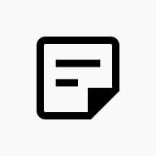

<a name="readme-top"></a>

# Notes app

<br />
<div align="center">
  <a href="https://github.com/USpiri/next-notes">
    
  </a>

  <p align="center">
    Simple, extensible and minimal notetaking app based on TipTap.
    <br />
    <a href="https://github.com/USpiri/next-notes/"><strong>Explore the docs »</strong></a>
    <br />
    <br />
    <a href="https://notes.uspiri.com/">View Demo</a>
    ·
    <a href="https://github.com/USpiri/next-notes/issues/new?labels=bug&template=bug-report.md">Report Bug</a>
    ·
    <a href="https://github.com/USpiri/next-notes/issues/new?labels=enhancement&template=feature-request.md">Request Feature</a>
    <br />
    <a href="/CHANGELOG.md"><strong>CHANGELOG</strong></a>
  </p>
</div>

## About Notes

[![Notes app Screen Shot][product-screenshot]](https://notes.uspiri.com)

Notes aims to be an intuitive, simple and easy-to-use project that can be extended to new needs. It's an evolution from a TipTap implementation to a note management and organization app that I use every day.

Part of the objective, also, is to incorporate new technologies (for me) and that is why new technologies are adopted.

### Built With

- [![Next][Next.js]][Next-url]
- [![Tailwind CSS][Tailwind]][Tailwind-url]
- [![TipTap][TipTap]][TipTap-url]
- [![Zustand][Zustand]][Zustand-url]

<p align="right">(<a href="#readme-top">back to top</a>)</p>

### Features

- **Custom Text editor:** Based on TipTap with StarterKit Plugin.
- **Custom components:** Callout, MathDisplay, MathInline, etc.
- **Syntax Highlight:** for Codeblocks. [See more](https://notes.uspiri.com/?note=syntax).
- **MathPlugin:** KaTeX implementation for math expressions. Inspired on [BenRBray](https://benrbray.com/) [Math Plugin](https://benrbray.com/projects/prosemirror-math). See [languages supported](https://notes.uspiri.com/?note=math).
- **Internal links:** Allow the creation of [links between notes](https://notes.uspiri.com/?note=routing).
- **LocalStorage Note Management:** Allows the creation of notes and nested folders for better organization.
- **Note Only Editor:** Shortcuts and commands that allow the use of the editor without the MenuBar (Activate `inline` editor)

<br />

[![Notes app Screen Shot][product-screenshot-2]](https://notes.uspiri.com)

[![Notes app Screen Shot][product-screenshot-1]](https://notes.uspiri.com)

<p align="right">(<a href="#readme-top">back to top</a>)</p>

## Roadmap

- [x] Add CHANGELOG.md
- [ ] Add Image display
- [ ] Drag&Drop for folders, notes and editor components
- [ ] Add Template notes
- [ ] Add Charts
- [ ] Add Tables
- [ ] Improve documentation
- [ ] Add Light mode
- [ ] Make a [Tauri App](https://tauri.app/)

<p align="right">(<a href="#readme-top">back to top</a>)</p>

## Contact

**Uriel Spiridione** - [@UrielSpiridione](https://twitter.com/UrielSpiridione) - urielspiridione135@gmail.com

**Project Link:** [https://github.com/USpiri/next-notes/](https://github.com/USpiri/next-notes/)

[![LinkedIn][linkedin-shield]][linkedin-url]

<p align="right">(<a href="#readme-top">back to top</a>)</p>

## Getting Started

### Prerequisites

Install dependencies

```sh
npm install npm@latest -g
```

And then, run the development server:

```bash
npm run dev
```

Open [http://localhost:3000](http://localhost:3000) with your browser to see the result.

### Learn More

To learn more about Next.js, take a look at the following resources:

- [Next.js Documentation](https://nextjs.org/docs) - learn about Next.js features and API.
- [Learn Next.js](https://nextjs.org/learn) - an interactive Next.js tutorial.

<p align="right">(<a href="#readme-top">back to top</a>)</p>

[linkedin-shield]: https://img.shields.io/badge/-LinkedIn-black.svg?style=for-the-badge&logo=linkedin&colorB=555
[linkedin-url]: https://linkedin.com/in/othneildrew
[product-screenshot]: images/screenshot.png
[product-screenshot-1]: images/screenshot1.png
[product-screenshot-2]: images/screenshot2.png
[Next.js]: https://img.shields.io/badge/next.js-000000?style=for-the-badge&logo=nextdotjs&logoColor=white
[Next-url]: https://nextjs.org/
[Tailwind]: https://img.shields.io/badge/Tailwind-20232A?style=for-the-badge&logo=tailwindcss&logoColor=38bdf8
[Tailwind-url]: https://tailwindcss.com/
[TipTap]: https://img.shields.io/badge/TipTap-white?style=for-the-badge&logo=typescript&logoColor=black
[TipTap-url]: https://tiptap.dev/
[Zustand]: https://img.shields.io/badge/Zustand-111827?style=for-the-badge&logo=typescript&logoColor=white
[Zustand-url]: https://zustand-demo.pmnd.rs/
